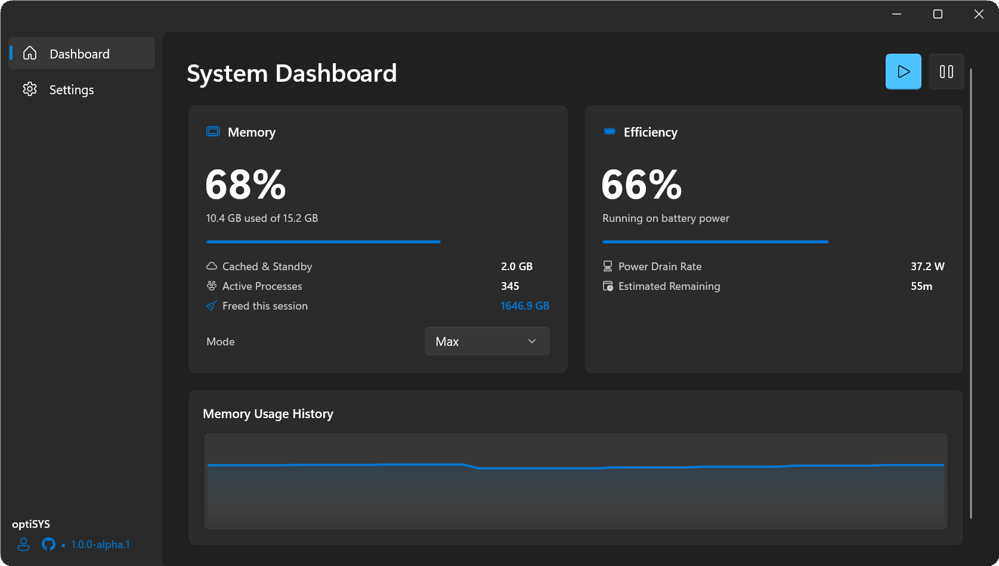
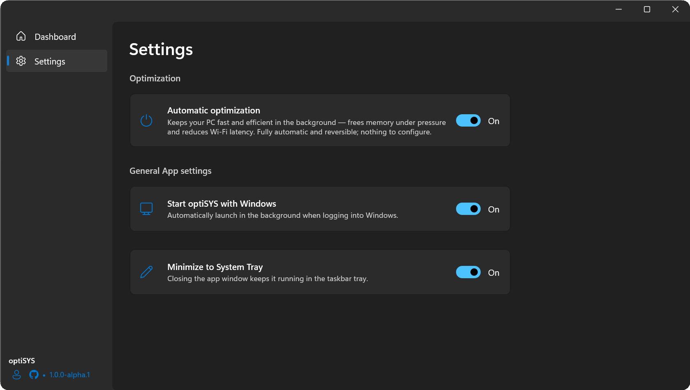

<div align="center">


# optiSYS

**A native Windows optimizer for memory, battery, and latency. Automatic, reversible, silent.**

[](LICENSE)
&nbsp;
&nbsp;
&nbsp;
&nbsp;

</div>

optiSYS is a WinUI 3 application on .NET 9. It lives in the system tray, measures the machine
continuously, and acts only on evidence. Every action is reversible, and no Windows setting you
can see is ever changed.

## Screenshots

<div align="center">



<br /><br />



</div>

## What it does

**Battery.** Background processes with sustained, measured CPU burn are placed in Windows
efficiency mode (EcoQoS). Processes that wake the CPU excessively are also opted out of
high-resolution timers, which protects the deep package sleep states battery life depends on.
Applications playing audio, the foreground application, and protected apps are never touched.
Coverage widens while you are away from the machine and releases within seconds of your first
input. In a high-performance or game mode, optiSYS stands down entirely.

**Memory.** Continuous monitoring with a predictive trigger gated on real commit pressure. The
reclaim pipeline trims working sets and manages standby and cache, and it learns which steps are
effective on your machine and skips the rest. Processes that are actively working, or whose trims
do not stick, are deprioritized unless memory is genuinely needed.

**Wi-Fi latency.** Optionally disables background scanning on the active adapter, removing the
periodic latency spikes Windows introduces on a live connection.

**Services.** Optionally sets a small, curated set of non-essential services to manual start.
Start type only, never stopped, behind a one-time elevation grant.

A single switch turns automatic optimization on or off. There is nothing else to configure.

## Design principles

optiSYS never trades performance for savings. The foreground application and critical system
processes are untouched, every change can be reverted, and user-facing Windows settings such as
power mode, brightness, and refresh rate are never modified. Decisions come from measurement
rather than rules of thumb: CPU time, wakeup rates, audio sessions, and reclaim effectiveness,
sampled continuously at near-zero cost. The monitoring itself idles at a fraction of a percent of
one core.

## Install

Download the latest `optiSYS-<version>-setup.exe` from [Releases](../../releases) and run it.
One UAC prompt, then it installs and launches with no further clicks. Settings from earlier
versions migrate automatically.

## Architecture

Optimization logic lives in `OptiSYS.Core` behind one contract, `IOptimizationDomain`: capture
baseline, apply, revert, report status. The engine composes the registered domains and owns the
snapshot and revert lifecycle. `OptiSYS.App` is the single-window WinUI shell, the tray, and the
runtime and automation services, wired through dependency injection.

| Project | Role |
| --- | --- |
| `OptiSYS.Core` | Platform logic and the single P/Invoke layer; fully testable, no UI. |
| `OptiSYS.App` | WinUI 3 single-window UI, system tray, and automation services. |
| `OptiSYS.Tests` | xUnit, Moq, and FluentAssertions; mirrors the source layout one-to-one. |

## Build from source

Requires the .NET 9 SDK on Windows (x64).

```
dotnet build src/OptiSYS.sln -c Debug
dotnet test  src/OptiSYS.sln -c Debug
dotnet run   --project src/OptiSYS.App
```

## Requirements

Windows 10 (build 1809 or later) or Windows 11, x64.

## License

Released under the MIT License. See [LICENSE](LICENSE).
